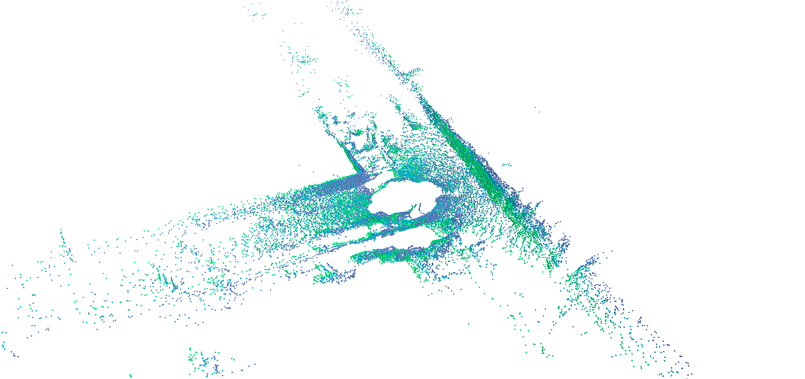
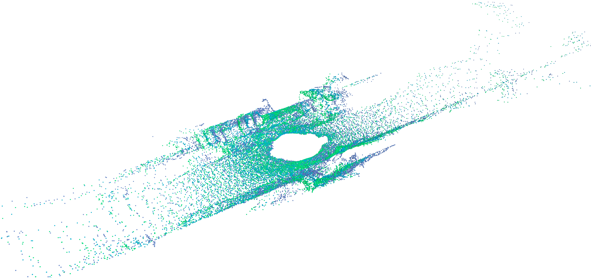

# MoCoPCI: Inter-frame Motion Correlation Guided Efficient 3D Point Cloud Interpolation
:wave: This is the official repository for MoCoPCI.

Code is coming soon...

## Introduction
LiDAR point cloud streams provide precise 3D mapping and detailed spatial information but limited temporal resolution due to hardware constraints.  Multi-frame point cloud interpolation, which synthesizes intermediate frames between consecutive point clouds, presents a promising solution. However, previous methods treat point cloud sequence interpolation as an iterative process, resulting in prolonged inference times and making it challenging to maintain the temporal consistency of the predicted point cloud sequence. To address these issues, we propose MoCoPCI, a novel *one-shot* sequence interpolation framework designed for *faster and more accurate* nonlinear predictions. The core of our approach is a motion correlation-based bidirectional flow prediction, which ensures temporal consistency in the predicted point cloud sequence while significantly improving efficiency. Additionally, we introduce a cross-attention mechanism based on extrapolation and injection to capture multi-scale motion information from consecutive frames. Meanwhile, a point-wise compensation mechanism refines the wrapped points, collectively enhancing the network’s ability to model nonlinear and non-rigid motion. Experiments on benchmark outdoor datasets show that MoCoPCI achieves state-of-the-art performance, reducing the Chamfer distance by up to 24.35\% and providing a 2× speedup.

## Interpolation Visualization

  
  

